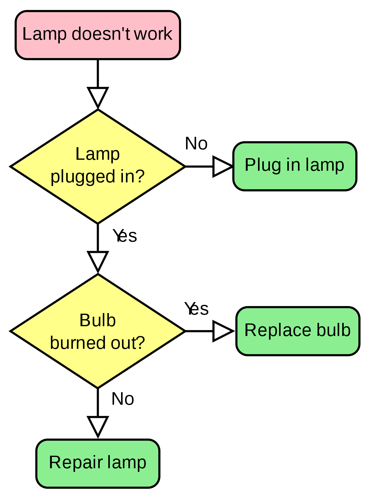

# ProjectLearningCleanshing
this is learning ProjectLearningCleanshing for cleanshing documen with python
## happy to clone or branch

Open Document
1. tujuannya untuk dokumen apa ?
2. dokumennya mau dibuka seperti apa ?
3. mau format pembacaannya seperti apa ?

jawab:
1. text file
2. read and write
3. default

Saat kalian membuka file dengan python, kalian tidak perlu mengimport library apapun.
kenapa ? karena sudah dihandle secara native oleh bahasa ini. meskipun dengan cara yang unik.

pertama kalian akan membutuhkan function build in "open" dari bahasa python untuk membuat object file,
fucntion open kemudian membuka file tersebut.

saat kalian menggunakan function open, return value nya disebut sebagai file object.
file object mengandung metode dan atribut yang dapat digunakan untuk mengumpulkan informasi dari file yang kamu buka.
nah function ini juga bisa digunakan untuk memanipulasi file.

####bagaimana caranya ?
mudah sekali. bisa dicoba.
sumber: http://www.pythonforbeginners.com/files/reading-and-writing-files-in-python

>file_object = open('sample.txt','r')

>print file_object.read()

Program diatas adalah untuk membuka file dengan metode function open.
untuk bisa dapat membaca file, metode yang bisa dipakai adalah read.

###Buat FlowChart Baru Program
Setelah dipikir-pikir, untuk memahami sebuah logic, kita jangan langsung terjun langsung ke sebuah code,
hal pertama yang harus dipikirkan adalah bagaimana kita membuat sebuah potongan-potongan logic menjadi sebuah
satu kesatuan logic, kita sebut saja sebagai master logic.

untuk itu perlu belajar dulu ke flow chart.
simplenya flowchart adalah sebuah gambar atau chart yang menjelaskan alur dari proses sebuah algoritma.
dari masing-masing gambar/chart bisa mewakili masing-masing proses.

Ada gambar apa aja sih d i flowchart, gw simplein aja yah
 

Logic diatas bisa dibaca seperti ini, 
1. apakah lampu itu bekerja ?
2. apakah lampu terpasang ? jika tidak maka pasang lampunya
3. dst. 

Sangat gampang kan membaca flowchart ?

menurut gw sih begini bacanya, 
1. simbol persegi panjang adalah sebuah statment pekerjaan yang dilakukan. 
2. simbol wajig atau belah ketupat itu adalah stetment logic if than else. 
3. ada lagi simbol jajar genjang, itu isinya input dan output. 
4. dan garis-garis itu adalah alur dari flowchart. 

biar ngerti harusnya diflowchart itu diberi nomer. 

